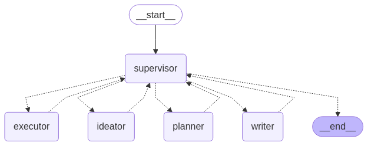

# Multi-Agent LangGraph: Sistema Criativo e Solucionador

Este projeto demonstra a aplicação de uma arquitetura de agentes colaborativos utilizando [LangGraph](https://docs.langchain.com/langgraph/), combinada com LLMs (modelos de linguagem de grande escala), ferramentas externas e uma interface interativa em Streamlit. O sistema foi projetado para simular um fluxo de trabalho multiagente com especializações distintas em dois modos operacionais:

- **Modo Solucionador**: agentes que planejam e executam soluções técnicas.  
- **Modo Criativo**: agentes que ideiam e redigem conteúdos com foco em geração criativa.

---

## Funcionalidades

### Arquitetura Multiagente com LangGraph  
Implementação de uma rede dinâmica com nós especializados para supervisão, planejamento, execução, ideação e redação, coordenados por um *Supervisor LLM*.

### Modos Operacionais Dinâmicos  
O usuário pode escolher entre dois fluxos distintos:

- **Solucionador**: combina agentes *planner* e *executor* para estruturar e realizar tarefas técnicas com apoio de ferramentas como **REPL Python** e **pesquisa web**.  
- **Criativo**: utiliza agentes *ideator* e *writer* para geração de ideias e redação de textos com criatividade.

### Integração com Ferramentas Externas

- **Tavily Search**: para pesquisas na web em tempo real no modo solucionador.  
- **Python REPL**: para execução de código e cálculos durante a etapa de execução.

### Gerenciamento de Estado e Sessões

- **Checkpointing** com `InMemorySaver`, identificador único de sessões via UUID.  
- **Histórico de conversas** persistente durante a sessão via `st.session_state`.

### Interface Web com Streamlit  
Interface responsiva com seletor de modo, histórico de mensagens e interações em estilo de chat.

---

## 🧩 Arquitetura dos Agentes

